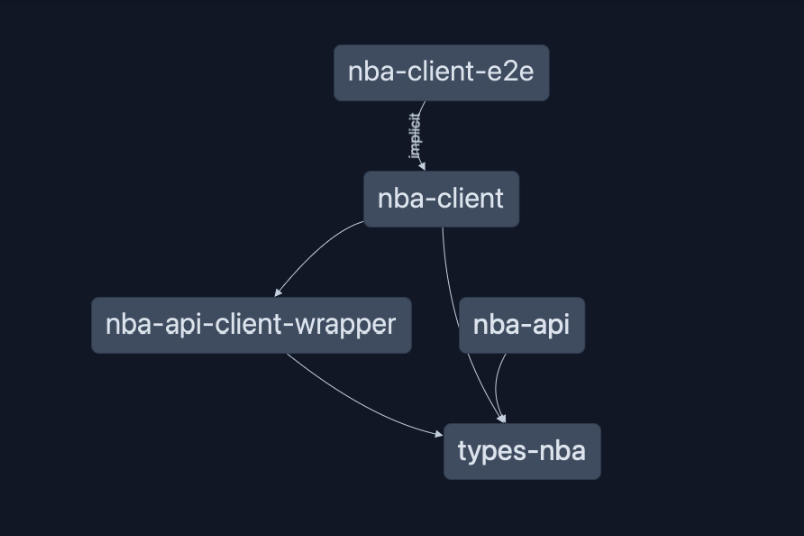

# NBA App

[](https://codecov.io/gh/matiushariman/nba-app)

<!-- ABOUT THE PROJECT -->
## About The Project

NBA app is a web application for viewing live NBA data*.

_* At the moment live data is available only in development mode._

DEMO URL: https://nba.matiushariman.com/

### Features
- View today's NBA games
- View game details, such as:
  - Summary:
    - Linescores
    - Top performers
    - Team comparison
    - Injury list

### Built With

[![Nx][nx-shield]][nx-url]
[![Typescript][typescript-shield]][typescript-url]

#### Frontend
[![ReactJS][react-shield]][react-url]
[![Tailwind][tailwind-shield]][tailwind-url]

#### Backend
[![NestJS][nest-shield]][nest-url]

#### Testing
[![Jest][jest-shield]][jest-url]
[![Playwright][playwright-shield]][playwright-url]
[![RTL][rtl-shield]][rtl-url]

<!-- GETTING STARTED -->
## Getting Started

### Installation

1. Clone the repo
   ```sh
   git clone https://github.com/matiushariman/nba-app.git
   ```
2. Install NPM packages
   ```sh
   yarn install
   ```

### Development

To run the app (client & server)
   ```sh
   yarn start
   ```
To run the client app
   ```sh
   yarn start:client
   ```
To run the server app
   ```sh
   yarn start:server
   ```

### Testing

To run unit/integration tests (client)
   ```sh
   yarn test:client
   ```
To run unit/integration tests (server)
   ```sh
   yarn test:server
   ```
To run e2e tests (client) *
   ```sh
   yarn test:client-e2e
   ```

_* In order to run e2e tests locally, both client & server app has to run._

## Dependency Graph



<!-- CONTACT -->
## Contact

[![LinkedIn][linkedin-shield]][linkedin-url]

<!-- MARKDOWN LINKS & IMAGES -->
[jest-shield]: https://img.shields.io/badge/-jest-%23C21325?style=for-the-badge&logo=jest&logoColor=white
[jest-url]: https://jestjs.io
[linkedin-shield]: https://img.shields.io/badge/linkedin-%230077B5.svg?style=for-the-badge&logo=linkedin&logoColor=white
[linkedin-url]: https://www.linkedin.com/in/matiushariman/
[nest-shield]: https://img.shields.io/badge/nestjs-%23E0234E.svg?style=for-the-badge&logo=nestjs&logoColor=white
[nest-url]: https://nestjs.com
[nx-shield]: https://img.shields.io/badge/nx-143055?style=for-the-badge&logo=nx&logoColor=white
[nx-url]: https://nx.dev
[playwright-shield]: https://img.shields.io/badge/Playwright-242526?style=for-the-badge&logo=playwright&logoColor=2EAD33
[playwright-url]: https://playwright.dev
[react-shield]: https://img.shields.io/badge/react-%2320232a.svg?style=for-the-badge&logo=react&logoColor=%2361DAFB
[react-url]: https://reactjs.org
[rtl-shield]: https://img.shields.io/badge/-TestingLibrary-%23E33332?style=for-the-badge&logo=testing-library&logoColor=white
[rtl-url]: https://testing-library.com/docs/react-testing-library/intro/
[tailwind-shield]: https://img.shields.io/badge/tailwindcss-%2338B2AC.svg?style=for-the-badge&logo=tailwind-css&logoColor=white
[tailwind-url]: https://tailwindcss.com
[typescript-shield]: https://img.shields.io/badge/typescript-%23007ACC.svg?style=for-the-badge&logo=typescript&logoColor=white
[typescript-url]: https://www.typescriptlang.org

